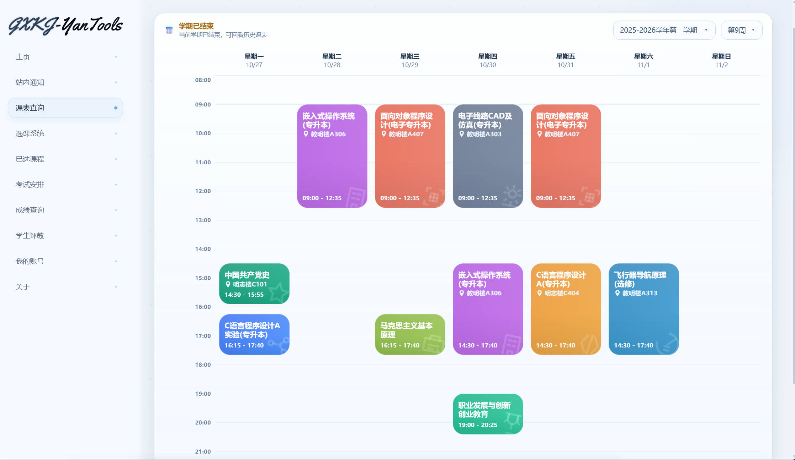
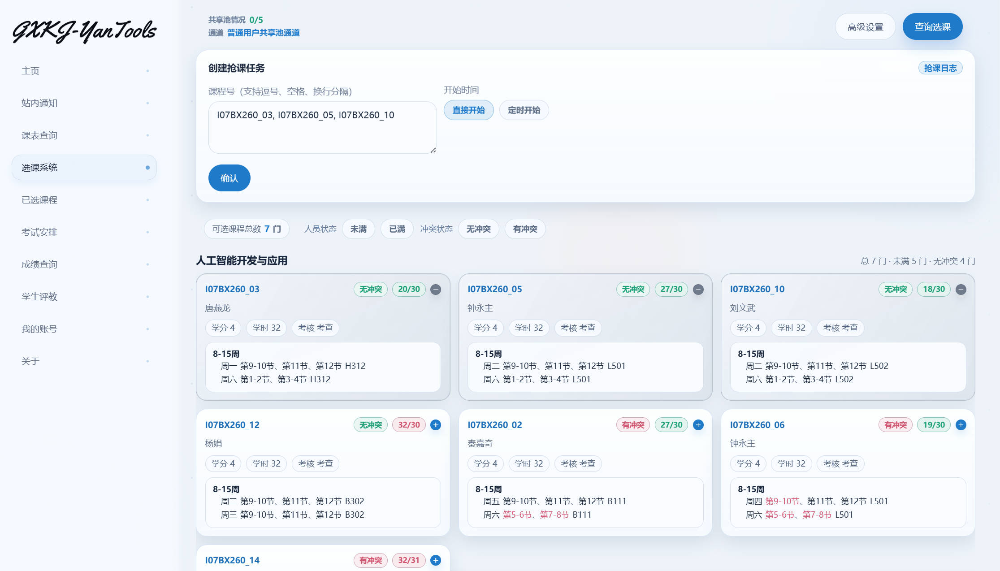
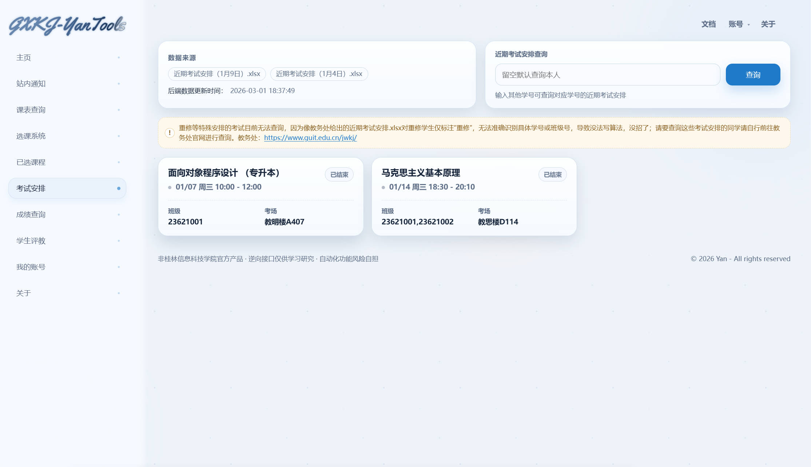

## 桂林信息科技学院教务系统的辅助工具

不用任何安装，没有任何收费，直接登录就能使用👉[**https://gxkj.yan.vin/**](https://gxkj.yan.vin/)

如果您觉得好用的话，还请您推荐给您的朋友、同学、校友等，谢谢您

GXKJ-YanTools 文档地址：https://docs.qq.com/aio/DV0pGRWtwSVhZVUNw?p=QZVCx6CBMOkUKQr05RaZY2

------

GXKJ-YanTools 是一个~~没啥用的~~桂信科辅助工具，本工具可以帮助您更方便获取日常需要的信息和自动化任务 如：非常详细的每周课程信息、可以自动帮您定时提交选课任务的选课系统、自动查询您最近的考试安排、成绩查询、自动化学生评教 等功能。详情请看实际 GXKJ-YanTools 里开放的菜单选项

**简单介绍几个功能：**

- **课表查询**

- - 自动判断当前是第几周，然后展示出本周有哪些课，也可输入查看其他周

  - 智能区分上课地点，根据教务处给的每栋教学楼的上下课时间表，进行展示上下课时间

    

- **选课系统**

- - 查询目前全部可选课的课，并且智能的进行和判断冲突检测

  - - 非虚拟，全部都是教务系统那边的接口返回的

  - 输入 课程号 或 查询后选择课程，然后选择开始时间，程序将会在你选择的时间进行自动抢课

    - AI自动判断错误，如遇到因课程冲突、满人等无法选择的课程系统将自动取消该课程的选择，不影响抢其他课程

  - 

- **考试安排**

- - 后端自动获取 近期考试安排（x月x日）.xlsx 的信息，并进行筛选，如有您的考试安排，会展示出来，更方便，不用下载任何东西

- 

- **自动评教(暂时不开放，等学期评教开始时开放)**

- - 根据你设定的评分值范围（默认80~100）去自动的帮你完成 未评估 的评估

- 等功能。。。

**数据全部来源于 教务系统（ http://172.16.18.132 ）和 教务处（ https://www.guit.edu.cn/jwkj/ ）** ，所展示的效果都由数据进行算法处理后所展示，非虚假构造的数据，但您需要注意！**本工具非桂林信息科技学院官方产品，所有接口均通过逆向工程分析获得，仅供学习研究目的使用。**

> 目前手机端的UI适配比较差，目前也没有时间优化，因为在住院，后续等恢复好了再继续优化手机端，如果你最求比较好的体验，Yan 建议您使用电脑进行使用，目前已适配 Edge 和 Chrome，其他浏览器未知

该项目由 Yan 长期独立维护。您的每一次反馈、建议与赞赏，都是推动 GXKJ-YanTools 持续更新的重要动力。若您认可它的价值，欢迎通过下方方式支持项目维护。您的支持会直接用于服务运行、功能优化与后续迭代，让工具变得更稳定、更好用。

|                           微信赞赏                           |                          支付宝赞赏                          |
| :----------------------------------------------------------: | :----------------------------------------------------------: |
|  |  |

### 联系方式：

**Yan 不会再任何平台上主动联系您，Yan 的联系方式只有下方的联系方式，没有其他任何联系方式，请注意辨别真假！以免受骗！**

您有任何反馈、建议、需求、帮助、合作等，可以通过下方的联系方式联系到我（Yan）

**邮箱：**yan@yjf.vin
**QQ：**43891963（因为QQ限制，好像是搜索不到了，有事联系邮箱吧）